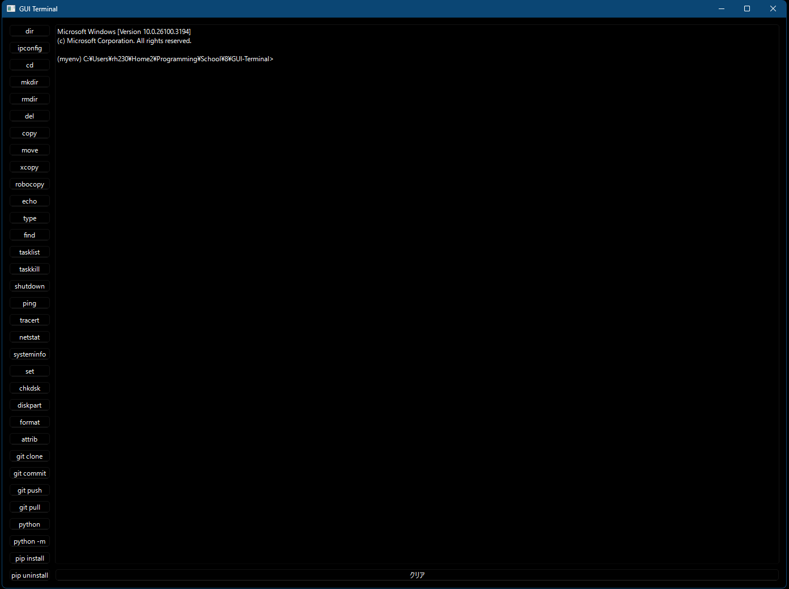
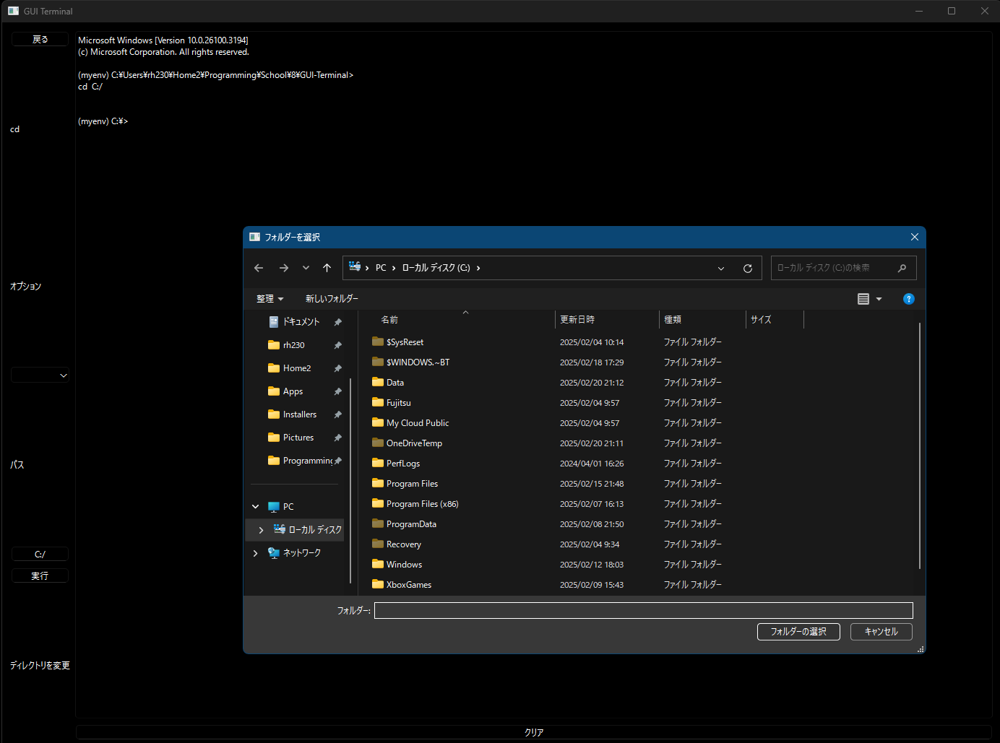
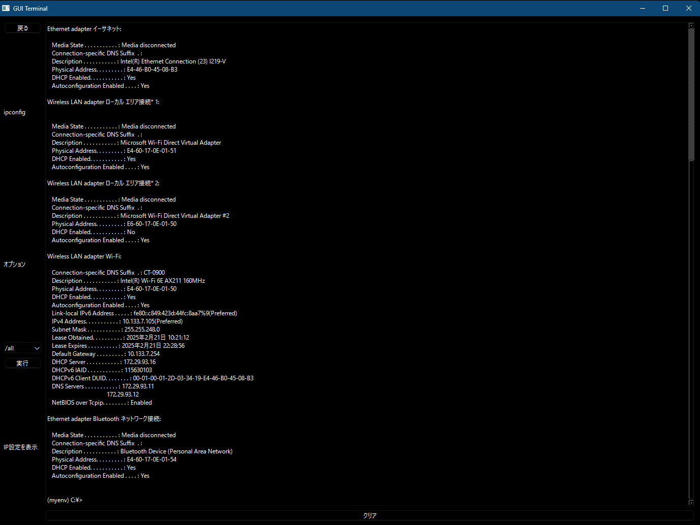

# GUI Terminal

## 📖 Overview

This application is a GUI-based version of Windows' cmd. It supports basic commands, Git commands, and Python commands. It is designed to be easy to use, even for beginners in programming.




## 🛠️ Main Features

- ✅ **Command Selection**

  A list of available commands is displayed.

- ✅ **Command Configuration & Execution**

  Clicking a command button shows a back button to return to the command list, a list of selectable command options, and a button to choose a path if the command requires one.

- ✅ **Preview**

  The right side of the application displays cmd, allowing users to see execution results in real time. A clear button is also available to reset the display.

## 📥 Installation

```bash
git clone https://github.com/shimo0412/GUI-Terminal
cd GUI-Terminal
```

## 🚀 Usage

1. **Step 1**:

```bash
python ./src/main.py
```

Run the command above.
2\. **Step 2**: Select the button for the command you want to use.
3\. **Step 3**: Choose command options and paths, then execute the command.

## 📷 Demo





## 💡 Development Environment

- Language: `Python`
- Library: `PySide6`

